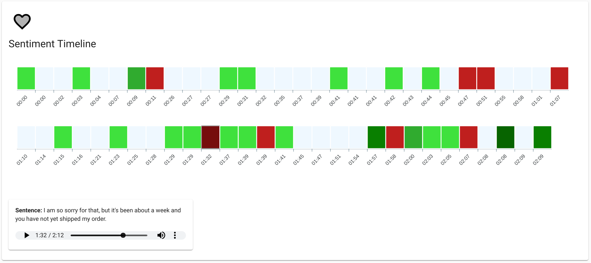

# Speech Analysis Framework

This repository contains the Speech Analysis Framework, a collection of components and code from Google Cloud that you can use to transcribe audio, and create a data pipeline workflow to display analytics of the transcribed audio files.

It can and:
* Process uploaded audio files to Cloud Storage.
* Enrich the processed audio files with Cloud Speech-to-Text and Cloud Natural Language APIs.
* Write the enriched data to BigQuery.
* Redact sensitive information with Cloud Data Loss Prevention.

You can:
* Gain insights into quality metrics to track such as call silence, call duration, agent speaking time, user speaking time, and sentence heat maps.
* Build visualizations reports
* Examples of what the visualizations you can build:



Speech Analysis Framework Limitations:
* The framework can only identify two callers on a stereo or mono audio file. This is a limitation within the Framework code not Cloud Speech-to-Text API.
* The framework can only process .wav or .flac files. This is a limitation within the Framework code not Cloud Speech-to-Text API.

The process follows:
1. An audio file is uploaded to Cloud Storage
2. The Cloud Function is triggered on object.create
3. The Cloud Function sends a long running job request to Cloud Speech-to-Text
4. The Cloud Function then sends the job ID from Cloud Speech-to-Text with additional metadata to Cloud Pub/Sub
5. The Cloud Dataflow job enriches the data, optionally redacts sensitive information and writes to BigQuery

To Learn More visit [Visualize speech data with Speech Analysis Framework](hhttps://cloud.google.com/solutions/visualize-speech-data-with-framework)

## How to install the Speech Analysis Framework

1. [Install the Google Cloud SDK](https://cloud.google.com/sdk/install)

2. Create a storage bucket for **Dataflow Staging Files**

``` shell
gsutil mb gs://[BUCKET_NAME]/
```

3. Through the [Google Cloud Console](https://console.cloud.google.com) create a folder named **tmp** in the newly created bucket for the DataFlow staging files

4. Create a storage bucket for **Uploaded Audio Files**

``` shell
gsutil mb gs://[BUCKET_NAME]/
```

5. Create a BigQuery Dataset
``` shell
bq mk [YOUR_BIG_QUERY_DATABASE_NAME]
```

6. Create Cloud Pub/Sub Topic
``` shell
gcloud pubsub topics create [YOUR_TOPIC_NAME]
```

7. Enable Cloud Dataflow API
``` shell
gcloud services enable dataflow
```

8. Enable Cloud Speech-to-Text API
``` shell
gcloud services enable speech
```

9. Enable Cloud Natural Language API
``` shell
gcloud services enable language.googleapis.com
```

10. Enable DLP __Optional__
``` shell
gcloud services enable dlp.googleapis.com
```

11. Deploy the Google Cloud Function
* In the cloned repo, go to the “saf-longrun-job-func” directory and deploy the following Cloud Function.
``` shell
gcloud functions deploy safLongRunJobFunc --region=us-central1 --stage-bucket=[YOUR_UPLOADED_AUDIO_FILES_BUCKET_NAME] --runtime=nodejs8 --trigger-event=google.storage.object.finalize --trigger-resource=[YOUR_UPLOADED_AUDIO_FILES_BUCKET_NAME]
```

12. Deploy the Cloud Dataflow Pipeline
* python3 --version Python 3.7.8
* In the cloned repo, go to “saf-longrun-job-dataflow” directory and deploy the Cloud Dataflow Pipeline. Run the commands below to deploy the dataflow job.
``` shell
# Apple/Linux
python3 -m venv env
source env/bin/activate
pip3 install apache-beam[gcp]
pip3 install dateparser
```
or
``` shell
# Windows
python3 -m venv env
env\Scripts\activate
pip3 install apache-beam[gcp]
pip3 install dateparser
```
* The Dataflow job will create the **BigQuery Table** you listed in the parameters.
* Please wait as it might take a few minutes to complete.
``` shell
python3 saflongrunjobdataflow.py --project=[YOUR_PROJECT_ID] --input_topic=projects/[YOUR_PROJECT_ID]/topics/[YOUR_TOPIC_NAME] --runner=DataflowRunner --temp_location=gs://[YOUR_DATAFLOW_STAGING_BUCKET]/tmp --output_bigquery=[DATASET NAME].[TABLE] --requirements_file="requirements.txt"
```

13. In the cloned repo, go to “sample-audio-files” to locate sample audio files to process by Speech Analysis Framework
* For the [TOPIC_NAME], do not include the full path, just the name of the TOPIC
* Choose true or false to run DLP. DLP will use all info types to scan the data.

``` shell
# stereo wav audio sample
gsutil -h x-goog-meta-dlp:[true or false] -h x-goog-meta-callid:1234567 -h x-goog-meta-stereo:true -h x-goog-meta-pubsubtopicname:[TOPIC_NAME] -h x-goog-meta-year:2019 -h x-goog-meta-month:11 -h x-goog-meta-day:06 -h x-goog-meta-starttime:1116 cp [YOUR_FILE_NAME.wav] gs://[YOUR_UPLOADED_AUDIO_FILES_BUCKET_NAME]
```

``` shell
# mono flac audio sample
gsutil -h x-goog-meta-dlp:[true or false] -h x-goog-meta-callid:1234567 -h x-goog-meta-stereo:false -h x-goog-meta-pubsubtopicname:[TOPIC_NAME] -h x-goog-meta-year:2019 -h x-goog-meta-month:11 -h x-goog-meta-day:06 -h x-goog-meta-starttime:1116 cp [YOUR_FILE_NAME.flac] gs://[YOUR_UPLOADED_AUDIO_FILES_BUCKET_NAME]
```

14. After a few minutes you will be able to see the data in BigQuery.
* Sample select statements that can be executed in the BigQuery console.
``` sql
-- Order Natural Language Entities for all records
SELECT
  *
FROM (
  SELECT
    entities.name,
    entities.type,
    COUNT(entities.name) AS count
  FROM
    `[YOUR_PROJECT_ID].[YOUR_DATASET].[YOUR_TABLE]`,
    UNNEST(entities) entities
  GROUP BY
    entities.name,
    entities.type
  ORDER BY
    count DESC )
```

``` sql
-- List word, start time, end time, speaker tag and confidence for all records
SELECT
  ARRAY(
  SELECT
    AS STRUCT word,
    startSecs,
    endSecs,
    speakertag,
    confidence
  FROM
    UNNEST(words)) transcript
FROM
  `[YOUR_PROJECT_ID].[YOUR_DATASET].[YOUR_TABLE]`
```

``` sql
-- Search Transcript with a regular expression
SELECT
  transcript,
  fileid,
  callid,
  year,
  month,
  day,
  sentimentscore,
  magnitude,
  date,
  silencesecs
FROM
  `[YOUR_PROJECT_ID].[YOUR_DATASET].[YOUR_TABLE]`
WHERE
  (REGEXP_CONTAINS(transcript, '(?i) [YOUR_WORD]' ))
```

**This is not an officially supported Google product**